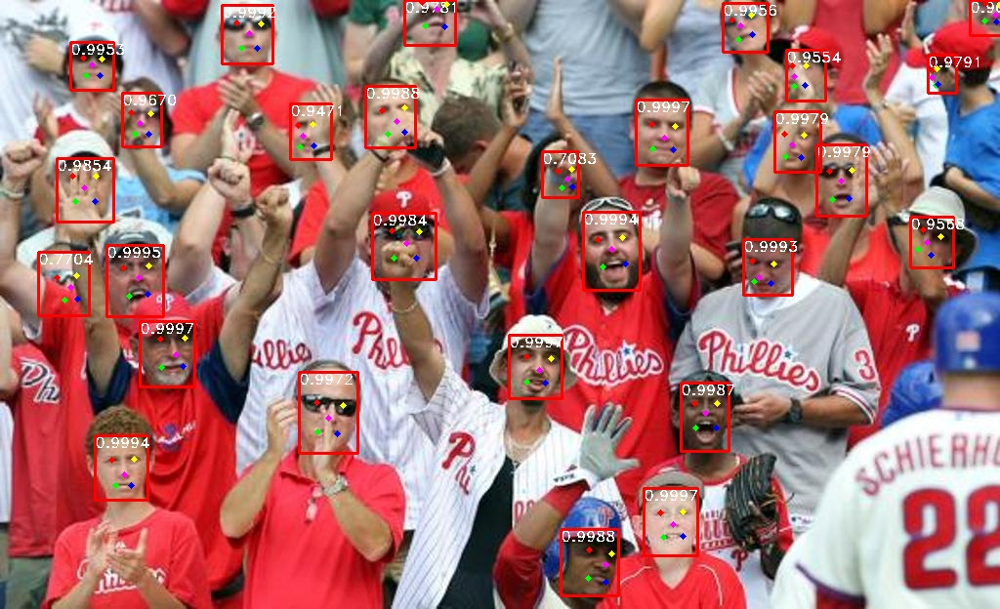

# RetinaFace_paddle
RetinaFace in Paddle
## 一、简介
本项目采用百度飞桨框架paddlepaddle复现：RetinaFace: Single-stage Dense Face Localisation in the Wild

paper：[RetinaFace: Single-stage Dense Face Localisation in the Wild](https://arxiv.org/pdf/1905.00641v2.pdf)

code：[RetinaFace](https://github.com/deepinsight/insightface/blob/master/detection/retinaface/README.md)

本代码参考 [Pytorch_Retinaface](https://github.com/biubug6/Pytorch_Retinaface)

## 二、复现结果

本代码只要复现论文的Table3，数据集为widerface，backbone为resnet50

|Method |Easy |Medium |Hard |mAP|
|  ----  |  ----  |  ----  |  ----  |----  |
|FPN+Context |95.532 |95.134 |90.714 |50.842|
|+DCN |96.349 |95.833 |91.286 |51.522|
|+Lpts |96.467 |96.075 |91.694 |52.297|
|+Lpixel |96.413 |95.864 |91.276 |51.492|
|+Lpts + Lpixel |96.942 |96.175 |91.857 |52.318|
|map(500)|93.611|89.031|62.938  |54.802|
|map(800)|**94.592**|**92.397**|78.909  |60.129|
|map(1100)|92.304|91.404|82.444 |59.698|
|map(1400)|89.233|89.520|**82.653** |58.138|
|map(1700)|87.831|88.712|82.595 |57.478|
|multiscale |91.515 |90.218 |77.908 |58.049|




## 三、环境依赖
- 框架：Paddle 2.1.2
- 硬件：nvidia GPU
## 四、实现

### 训练

#### 下载数据集

1. 下载WIDERFACE数据集

[下载链接aistudio](https://aistudio.baidu.com/aistudio/datasetdetail/104236)

```
  /widerface/
    train/
      images/
      label.txt
    val/
      images/
      wider_val.txt
```

#### 开始训练

```sh
python train.py --network resnet50
# or 
python -m paddle.distributed.launch train.py --network resnet50
```

权重保存在./weights目录下

### 测试

#### 下载权重
[weights](https://pan.baidu.com/s/1NjmFTLoDVS1VjfTfwUFc_Q) 提取码：kdoi。


权重保存在./weights目录下

#### 生成txt文件

```
python test_widerface.py --trained_model weights/Resnet50_Final.pdparams
```

#### 评估txt文件
```
cd ./widerface_evaluate
python setup.py build_ext --inplace
cd ..
python widerface_evaluate/evaluation.py
```

## 五、代码结构


```
./RetinaFace_paddle
├─models               #模型
├─data                 #数据集相关的API和网络的config   
├─layers               #loss等层实现
├─models               #模型相关
├─utils                #预测框相关的API  
├─weights              #权重
├─widerface_evaluate   #评估工具包
|  README.md                               
│  test_widerface.py   #测试
│  test.jpg            #测试图片
│  train.py            #训练

```

## 六、模型信息

|  信息   |  说明 |
|  ----  |  ----  |
| 作者 | showtime |
| 时间 | 2021.09 |
| 框架版本 | Paddle 2.1.2 |
| 应用场景 | 人脸检测 |
| 模型权重 | [weights](https://pan.baidu.com/s/1NjmFTLoDVS1VjfTfwUFc_Q) |
| 飞桨项目 | [RetinaFace_Paddle](https://github.com/sukibean163/RetinaFace_Paddle) |
|  数据集  |  [widerface](https://aistudio.baidu.com/aistudio/datasetdetail/104236)|
